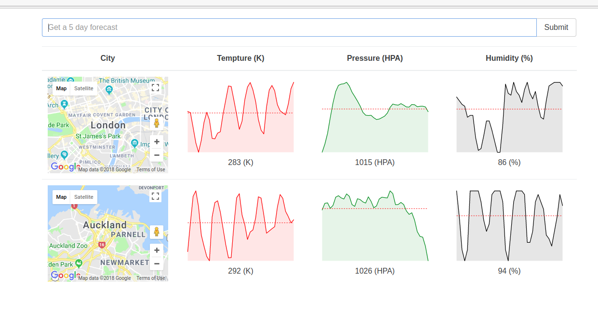

# Simple Weather App

Simple application that uses React, Redux and Open Weather Map API.



### Getting Started
```
> git clone https://github.com/xsv24/SimpleWeatherApp.git
> cd YoutubeMockReact
> Add Open Open Weather Map API KEY into './src/actions/index.js'
> npm install
> npm start

```